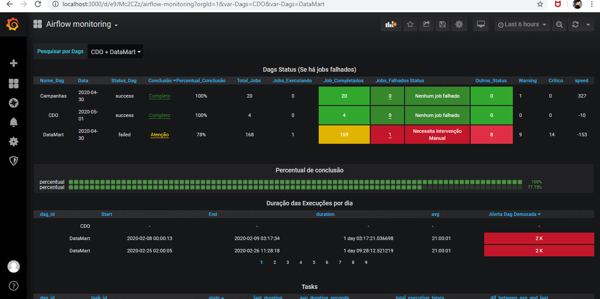
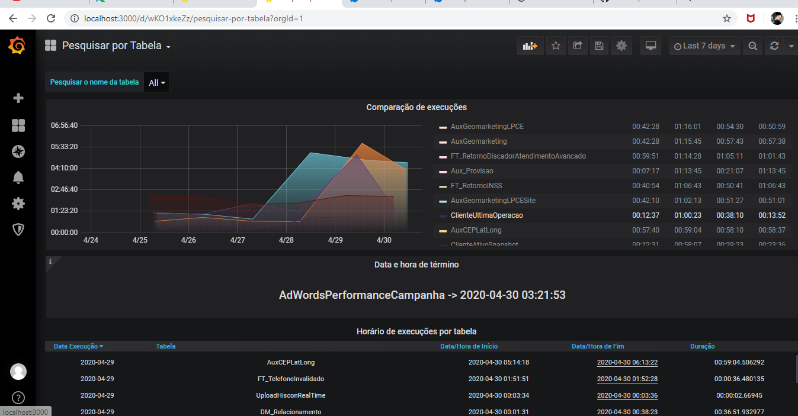

# Grafana
----
## Objetivo

> Este projeto foi desenvolvido para melhor visualização de todas as dags do airflow utilizando a ferramenta Grafana. A conexão foi feita através do postgre e criado dois dashboards.

### Queries executadas na base de dados do Airflow (postgresql)

[Queries](<./Airflow_Grafana_Queries.sql>)

## Arquivo Json para importar o Dashboard com a configuração utilizada

 

[Pesquisa e comparação de cargas](<./Pesquisar por Tabela-1588283953620.json>)

 
